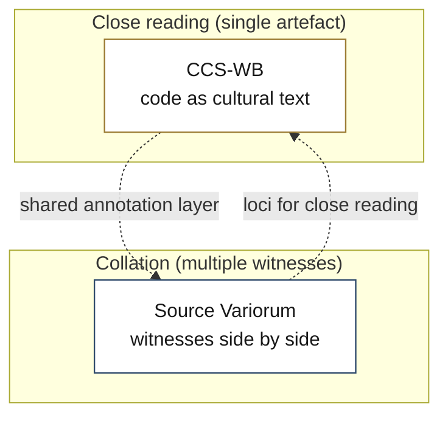

# Computational Hermeneutics

Research tools for computational close reading.

**🌐 Website and map: [computational-hermeneutics.github.io](https://computational-hermeneutics.github.io)**

Computational Hermeneutics is a family of tools that bring the apparatus of
textual criticism and interpretation to computational artefacts, to code as
much as to text. Software is written, copied, edited, forked, and revised; it
carries variants, witnesses, and emendations exactly as a literary text does,
and like a literary text it can be read closely or read comparatively. The
tools here treat computational artefacts as objects of reading rather
than only of execution or measurement, and they keep interpretation and
attestation bound together: no reading is offered without the evidence that
supports it. The tools are local-first, interpretively serious, and built for
close reading rather than distant measurement.

## The family

The tools are arranged in two registers. The close-reading register
opens a single artefact for intensive interpretation; the collation register
sets witnesses side by side and reads the differences between them.

### Close reading

- **[CCS Workbench](https://github.com/Computational-Hermeneutics/CCS-WB)**, the
  close reading of a single artefact of code. Annotation, critique, and
  interpretation in the critical code studies tradition, across three modes:
  critique, interpret, create. Live at
  [ccs-wb.vercel.app](https://ccs-wb.vercel.app).

### Collation

- **[Source Variorum](https://github.com/Computational-Hermeneutics/Source-Variorum)**,
  the collation of two or more witnesses of a text, code or prose. A braided
  workbench rendering additions, deletions, substitutions, and transpositions
  with an auto-generated critical apparatus. Live at
  [sourcevariorum.vercel.app](https://sourcevariorum.vercel.app).

## Map

## Further reading

The tools operationalise commitments developed across critical code
studies, textual scholarship, and the critical theory of computation. The
scholarship sets the conceptual ground; the tools are the working apparatus.

**Critical code studies:** Marino, M.C. (2020) *Critical Code Studies*
(MIT Press); Montfort, N. et al. (2014) *10 PRINT CHR$(205.5+RND(1))*
(MIT Press); Berry, D.M. (2011) *The Philosophy of Software* (Palgrave).

**Textual scholarship and hermeneutics:** McGann, J.J. (1991) *The Textual
Condition* (Princeton UP); McKenzie, D.F. (1999) *Bibliography and the
Sociology of Texts* (Cambridge UP); Gadamer, H.-G. (2004) *Truth and Method*.

**Critical theory of computation:** Berry, D.M. (2014) *Critical Theory and
the Digital* (Bloomsbury); Berry, D.M. and Fagerjord, A. (2017) *Digital
Humanities* (Polity); Ciston, S., Berry, D.M. et al. (2026) *Inventing ELIZA*
(MIT Press).

For per-tool deep dives and the full reading guide see
[computational-hermeneutics.github.io](https://computational-hermeneutics.github.io).

---

*Computational Hermeneutics is directed by
[David M. Berry](https://github.com/dmberry). The tools are offered
as-is under permissive licences. See each repository for
details.*
